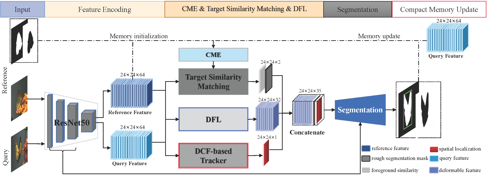

# Learning Dynamic Compact Memory Embedding for Deformable Visual Object Tracking

## Publication:
Pengfei Zhu, Hongtao Yu, Kaihua Zhang, Yu Wang, Shuai Zhao, Lei Wang, Tianzhu Zhang, Qinghua Hu.


<b>Learning Dynamic Compact Memory Embedding for Deformable Visual Object Tracking
[Paper](https://arxiv.org/abs/2111.11625) </br>


## Summary of CMEDFL
Recently, template-based trackers have become the leading tracking algorithms with promising performance in terms of efficiency and accuracy. However, the correlation operation
between query feature and the given template only exploits accurate target localization, leading to state estimation error especially when the target suffers from severe deformable variations.
To address this issue, segmentation-based trackers have been proposed that employ per-pixel matching to improve the tracking performance of deformable objects effectively. However, most of existing trackers only refer to the target features in the initial frame, thereby lacking the discriminative capacity to handle
challenging factors, e.g., similar distractors, background clutter, appearance change, etc. To this end, we propose a dynamic
compact memory embedding to enhance the discrimination of the segmentation-based deformable visual tracking method.
Specifically, we initialize a memory embedding with the target features in the first frame. During the tracking process, the
current target features that have high correlation with existing memory are updated to the memory embedding online. To
further improve the segmentation accuracy for deformable objects, we employ a point-to-global matching strategy to measure
the correlation between the pixel-wise query features and the whole template, so as to capture more detailed deformation
information. Extensive evaluations on six challenging tracking benchmarks including VOT2016, VOT2018, VOT2019, GOT-10K,
TrackingNet, and LaSOT demonstrate the superiority of our method over recent remarkable trackers. Besides, our method outperforms the excellent segmentation-based trackers, i.e., D3S and SiamMask on DAVIS2017 benchmark.



## Installation

#### Clone the GIT repository.
```bash
git clone https://github.com/peace-love243/Learning-Dynamic-Compact-Memory-Embeddingfor-Deformable-Visual-Object-Tracking.git.
```

#### Install dependencies
Run the installation script to install all the dependencies. You need to provide the conda install path (e.g. ~/anaconda3) and the name for the created conda environment (here pytracking).
```bash
bash install.sh conda_install_path pytracking
```
To install the dependencies on a Windows machine, use the `install.bat` script.

The tracker was tested on the Linux 16.04.1 Ubuntu with 1 NVidia GTX Titan XP card and cudatoolkit version 10.

#### Test the tracker
1.) Specify the path to the CMEDFL model by setting the `params.pth_path` in the `pytracking/parameters/segm/segm_default_params.py`. <br/>
2.) Specify the path to the VOT 2018 dataset by setting the `home/data-path` in the `votTester/vot.py`. <br/>
3.) Activate the conda environment
```bash
conda activate pytracking
```
4.) Run the run_vot_test.py to test CMEDFL using VOT18 benchmark.
```bash
python run_vot_test.py
```
or 
```bash
cd pytracking
python run_tracker.py segm default_params --dataset benchmark
```

5.) Run the test_davis.py to test CMEDFL using DAVIS2017 benchmark.
```bash
python test_davis.py --dataset DAVIS2017
```


#### Training the network
The CMEDFL is pre-trained for segmentation task only on the YouTube VOS dataset. Download the VOS training dataset (2018 version) and copy the files `vos-list-train.txt` and `vos-list-val.txt` from `ltr/data_specs` to the `train` directory of the VOS dataset.
Set the `vos_dir` variable in `ltr/admin/local.py` to the VOS `train` directory on your machine.

Run training by running the following command:
```bash
python run_training.py segm segm_default
```

## Pytracking
This is a modified version of the python framework pytracking and based on **PyTorch**. We would like to thank the authors Martin Danelljan and Goutam Bhat for providing such a great framework.

## Contact
* Hongtao Yu (email: yuhongtao@tju.edu.cn)
* Pengfei Zhu (email: zhupengfei@tju.edu.cn)
